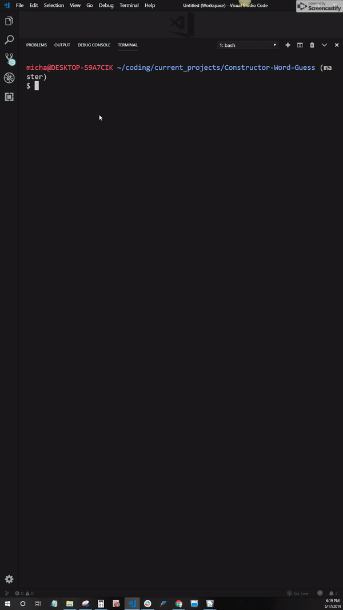

# Constructor-Word-Guess - A CLI version of Hangman using Node.js and Constructors

- The user is presented with a series of underscores representing the word
- The user starts with 15 guesses
- The user may enter any letter in the alphabet
- Validation is ran to ensure the input is not empty, a letter already used, mutiple letters, or a character other than letter
- If the user fails to guess the word or, guesses correctly, the answer is shown, and another word is presented
- This also uses [Npm-inquirer](https://www.npmjs.com/package/inquirer) with RegEx validation

  <hr>

## Getting Started

1. Clone the repo

```sh
git clone https://github.com/MichaelGentilini/Constructor-Word-Guess.git
```

2. Run the program

```sh
node index.js
```

  <hr>

<p align="center">
  
</p>

  <hr>

### You can also find this on my [GitHub](https://github.com/michaelgentilini/Constructor-Word-Guess "GitHub") or [Portfolio](https://mg-portfolio.netlify.com/ "Portfolio").
